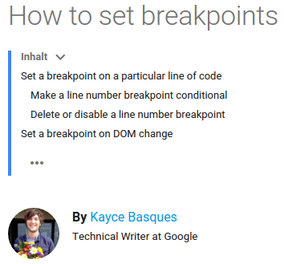
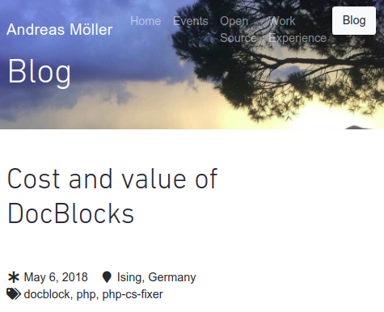

.. include:: ../Includes.txt

=============================================================
Style guides
=============================================================

Documentation guides
====================

.. http://docutils.sourceforge.net/docs/ref/rst/directives.html#image

-  `Microsoft Writing Style Guide <https://docs.microsoft.com/de-de/style-guide/welcome/>`__

-  |RTDlogo| `Documentation Guide <http://www.writethedocs.org/guide/>`__ of WriteTheDocs

-  The Python Style Guide https://docs.python.org/devguide/documenting.html

.. |RTDlogo| image:: http://www.writethedocs.org/_static/sticker-wtd-colors.png
   :width: 50px
   :target: http://www.writethedocs.org/

-  https://github.com/seanmadsen/elegant-docs by Sean Madsen (see Slack WTD) 

Links
=====

*  Quora: `What is the best style guide for writing technical user manuals?
   <https://www.quora.com/What-is-the-best-style-guide-for-writing-technical-user-manuals>`__

*  `The Writer's Handbook: Documentation Styles (writing.wisc.edu)
   <http://writing.wisc.edu/Handbook/Documentation.html>`__
   
*  `Apple Style Guide 2013 (PDF) <https://help.apple.com/asg/mac/2013/ASG_2013.pdf>`__
*  `Apple Style Guide 2013 (PDF) <http://cdn2.hubspot.net/hubfs/1772454/Blog_Images/01.26.16.Apple_Style_Guide.pdf>`__
*  http://www.chicagomanualofstyle.org/home.html

Related
=======

-  `EPPO - Every page is page one <http://everypageispageone.com/>`__
   Let the reader start reading anywhere.

What are tutorials, how-to guides, explanations, references?
============================================================

*  `Differences between “tutorial”, “guide” and “how-to”
   <https://english.stackexchange.com/questions/48388/differences-between-tutorial-guide-and-how-to>`__
   
      * A tutorial is a step-by-step walk-through for someone with no experience.
      * A guide gives basic information, not detailed instruction. Think "pointers".
      * Particularly for computers, a how-to is more of a list of detailed steps for 
        particular operations. Here's a list from the Linux Documentation Project
        
   **Note:** The Linux Documentation Project spells howto "HOWTO".        

*  `What nobody tells you about documentation
   <https://www.divio.com/en/blog/documentation/>`__ - a very good blogpost about 
   different kind of manuals by Daniele Procida, May 19, 2017

*  `Ubuntu: How to write a tutorial <https://tutorials.ubuntu.com/tutorial/tutorial-guidelines#0>`__

   .. figure:: Ubuntu-How-to-write-a-tutorial-teaser.png
      :class: with-shadow
      :alt: teaser image
      :target: https://tutorials.ubuntu.com/tutorial/tutorial-guidelines#0
      
      
Examples of tutorials
---------------------

- `SymPy tutorial <http://docs.sympy.org/latest/tutorial/>`__ versus `SymPy User's Guide
  <http://docs.sympy.org/latest/guide.html>`__
  
  
Dictionaries
============

Online dictionaries
-------------------

* Search `american dictionary 
  <https://www.startpage.com/do/dsearch?query=american+dictionary>`__

*  `Cambridge Dictionary: American English
   <https://dictionary.cambridge.org/de/worterbuch/amerikanisches-englisch/>`__
   
*  `Oxford Advanced American Dictionary
   <https://www.oxfordlearnersdictionaries.com/definition/american_english/>`__ 

Plus:

*  `Google Dictionary <http://www.dictionary.com/>`__ \|
   `Chrome extension <https://chrome.google.com/webstore/detail/google-dictionary-by-goog/mgijmajocgfcbeboacabfgobmjgjcoja>`__ 
   

Word list
---------

\| blog post
\| text role
\|

English grammar
===============

- `gymglish.com: 'Must' versus 'have to' <https://www.gymglish.com/en/english-grammar/must-vs-have-to>`__

English: Capitalization in titles
=================================

2016-11-02

My question at Slack in channel WriteTheDocs/General:

   "Let's say I (from de) want to write documentation for en_US. 
   What are the rules about what words should be capitalized in headlines? 
   Can you point me to some relevant information?"

From the answers:

-  here’s a short summary of the two common choices: 
   http://www.onlinegrammar.com.au/title-and-sentence-case/
   
-  an exhaustive description: 
   http://blog.apastyle.org/apastyle/2012/03/title-case-and-sentence-case-capitalization-in-apa-style.html
   
-  "Based on a tiny bit of prior experience working with writers for whom English
   was not their primary language: if you don't have to match some existing style,
   I'd say the sentence case—capitalizing the first word and any proper nouns
   is a bit easier to explain to others and to maintain."
   
-  "If you're asking about software documentation, there's been a pretty strong 
   trend for a number of years away from title case for any sort of heading or title. 
   Again, my default favorite for writing for the web:"
   https://pages.18f.gov/content-guide/capitalization/
   
-  "One frustrating trend that I’ve noticed is that enterprise website styles and support
   style guides use title case, and the tech docs rarely use it.
   This creates confusion when people are contributing to both."
   "True, marketing teams still love title case."
   
-  '''There are rules, but even native speakers get them wrong. 
   For example, "the" shouldn't be capitalized but I've seen 
   "How The Product Works" more than a few times. So even if you make a mistake, 
   you'll have plenty of company :) '''
   
-  Good blog post: 
   http://blog.apastyle.org/apastyle/2012/03/title-case-and-sentence-case-capitalization-in-apa-style.html
   
-  Recommendation: https://docs.microsoft.com/de-de/style-guide/capitalization

   
Online tools
------------

*  https://capitalizemytitle.com/ Capitalize My Title
*  https://titlecaseconverter.com/ Title Case Converter
*  https://headlinecapitalization.com/ Headline Capitalization
*  https://www.professionalediting.org/title-capitalization-tool/ Title Capitalization Tool
*  Summary of rules: https://www.grammarcheck.net/capitalization-in-titles-101/
*  Blog post: `The Best Title Capitalization Tools Online 2018
   <https://ladedu.com/the-best-online-title-capitalization-tools/>`__

Technical terms with translation
================================

=================================================== ====================
english                                             deutsch
=================================================== ====================
covering letter                                     Anschreiben
=================================================== ====================

Scientific or technical writing for non-native english speakers
===============================================================

2016-12-09

-  `5 Ways To Improve Scientific Writing For Non-native English Speakers
   <http://www.nextscientist.com/scientific-writing-non-native-english-speakers/>`__
   
-  `50 Essential Resources for ESL Students
   <http://oedb.org/ilibrarian/50_essential_resources_for_esl_students/>`__   
   
-  `What are the ⁠⁠⁠⁠lessons learned⁠⁠⁠⁠ for helping non-native speakers write clear technical English?`__ 

-   Editing the Work of Non-Native English Speakers [`On-Line Event`_], Youtube_

__ https://www.google.de/?gfe_rd=cr&ei=X8lKWKKpKZGQ8QfDqJXwBA#q=What%20are%20the%20%EF%BB%BF%E2%81%A0%E2%81%A0%E2%81%A0%E2%81%A0lessons%20learned%EF%BB%BF%E2%81%A0%E2%81%A0%E2%81%A0%E2%81%A0%20for%20helping%20non-native%20speakers%20write%20clear%20technical%20English%3F   

.. _On-Line Event: https://single-sourcing.com/events/2016/10/editing-the-work-of-non-native-english-speakers/
.. _Youtube: https://www.youtube.com/watch?v=gBTIQ5SnfPk

Commit messages
===============

-  http://chris.beams.io/posts/git-commit/#imperative !!!

.. include:: VariableNaming.inc.rst

Good examples of technical writing
==================================

Chrome DevTools
---------------

`How to set breakpoints <https://developers.google.com/web/tools/chrome-devtools/javascript/add-breakpoints>`__

   
Imperative style is used.

swagger.io
----------

https://swagger.io / https://github.com/OAI/OpenAPI-Specification/

   OpenAPI Specification
   (fka Swagger RESTful API Documentation Specification)
   Version 2.0

   The key words "MUST", "MUST NOT", "REQUIRED", "SHALL", "SHALL NOT", "SHOULD", "SHOULD NOT", "RECOMMENDED", 
   "MAY", and "OPTIONAL" in this document are to be interpreted as described in RFC 2119.
   
   The Swagger specification is licensed under The Apache License, Version 2.0.
   
Examples
========

Short sentences
---------------

Max the cat

   How to deal with Max, the cat

PHP DocBlocks
=============

Interesting blog post: https://localheinz.com/blog/2018/05/06/cost-and-value-of-docblocks/

